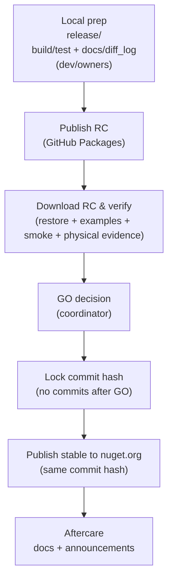

# Workflow: release roles & steps (Kafka.Context)

## 達成できる結果
利用者が迷わない公開物（NuGet / README / examples）を、**再現可能な手順**と**証跡**つきでリリースできる。

## Canonical release procedure（Single Source of Truth）
Kafka.Context のリリース手順は本ファイルを正とする。

---

## Release flow（Local → RC → Stable）

（Ksql.Linq の運用を参考にした）本 OSS の基本フロー:



注: CI（GitHub Actions）を導入していない場合は、GitHub Packages / nuget.org への publish は手動で行う（後述）。

---

## 1) 役割（Who does what）

| Role | Owner | Responsibility |
|------|-------|----------------|
| Release coordinator | 天城 | GO/NO-GO の判断、責務割当、最終チェックの収集 |
| Implementor | 鳴瀬 | 実装、API/挙動の最終整合、NuGet 生成物の確認 |
| Physical test owner | 詩音 | Windows 物理テストの実行、証跡の記録、再現条件の明文化 |
| Env/Infra owner | 凪 | docker-compose / Kafka / Schema Registry / ksqlDB の動作確認、環境トラブルの切り分け |
| Quality review | 鏡花 | README/Non-Goals/設定例の期待値固定、差分のレビュー |
| Evidence & log | 楠木 | `docs/diff_log/` と `reports/physical/` の整備、記録漏れ防止 |
| Docs & communication | 広夢（+必要なら文乃） | GitHub Release ノート/README の整備、周知文 |

---

## 2) ブランチと版管理（Branching / versioning）

### 2.1 ブランチ
- 作業ブランチ: `release/<version>`（例: `release/0.1.0`）
- GO 後は **commit hash をロック**（GO 判定〜タグ作成まで新規コミットを入れない）

### 2.2 Version の置き場所（推奨）
NuGet のバージョンは以下のいずれかで一元管理する:
- `src/Kafka.Context/Kafka.Context.csproj` に `<Version>` を置く（最小）
- または `Directory.Build.props` に `<Version>` を置いて全体で統一（拡張時）

---

## 3) リリース前チェック（Local prep）

### 3.1 変更点の記録（必須）
- API/挙動/設定の変更がある場合は `docs/diff_log/diff_<topic>_<YYYYMMDD>.md` を追加する。

### 3.2 README / examples（必須）
- NuGet 表示 README（`src/Kafka.Context/README.md`）が最新（QuickStart / Non-Goals / 設定 / DLQ / Preview 等）
- `examples/` がビルド可能（少なくとも QuickStart 相当）

---

## 4) テスト手順（Must run）

### 4.1 Unit tests（必須）
```powershell
dotnet test tests/unit/Kafka.Context.Tests/Kafka.Context.Tests.csproj -c Release
```

### 4.2 Physical tests（対象変更時は必須）
物理テストは Windows 前提で、docker-compose を起動して実行する。

```powershell
docker compose -f docs/environment/docker-compose.current.yml up -d
$env:KAFKA_CONTEXT_PHYSICAL = '1'
dotnet test tests/physical/Kafka.Context.PhysicalTests/Kafka.Context.PhysicalTests.csproj -c Release
```

**証跡（必須）**
- `reports/physical/physical_run_<YYYYMMDD>.md` に以下を残す:
  - 起動手順（compose / env / コマンド）
  - 観点（Provision / Add→ForEach / DLQ / cross-process SR）
  - 失敗時ログ（再現条件が分かる粒度）

---

## 5) GO/NO-GO（天城）

GO 判定に必要な最低条件:
- Unit tests が green
- Physical tests（対象時）が green（証跡がある）
- `docs/diff_log/` に差分が残っている（必要な場合）
- README が利用者導線として成立（Non-Goals/設定例/最短手順）

---

## 6) パッケージング & 公開（NuGet）

### 6.0 RC publish（必須: GitHub Packages）
目的: nuget.org の stable publish 前に、RC を配布して「DL→動作確認」を行う。

CI（推奨）:
- `release/**` push → `.github/workflows/publish-preview.yml` が RC を GitHub Packages に publish

#### 6.0.1 RC pack（ローカル）
`<version>-rcN` を明示して pack する（例: `0.1.0-rc1`）。

```powershell
dotnet pack src/Kafka.Context/Kafka.Context.csproj -c Release -o .\\artifacts\\nuget -p:Version=0.1.0-rc1
```

#### 6.0.2 RC publish（GitHub Packages）
GitHub Packages を NuGet feed として使う。

```powershell
# owner は GitHub org/user 名
$owner = "<OWNER>"
$gpr = "https://nuget.pkg.github.com/$owner/index.json"

dotnet nuget push .\\artifacts\\nuget\\Kafka.Context.0.1.0-rc1.nupkg -s $gpr -k "<GITHUB_TOKEN_WITH_PACKAGES>"
```

#### 6.0.3 RC download & verify（利用者目線の検証）
RC を **ダウンロード（restore/install）して**、examples + smoke + physical を確認する。

- RC を参照する `NuGet.config`（または `dotnet nuget add source`）を用意
- examples を RC で restore してビルド/実行
- Windows 物理テストを実行し証跡を残す（`reports/physical/`）

（例: source 登録）
```powershell
$owner = "<OWNER>"
$gpr = "https://nuget.pkg.github.com/$owner/index.json"
dotnet nuget add source $gpr -n github -u $owner -p "<GITHUB_TOKEN_WITH_PACKAGES>" --store-password-in-clear-text
```

---

### 6.1 Pack（必須）
```powershell
dotnet pack src/Kafka.Context/Kafka.Context.csproj -c Release -o .\\artifacts\\nuget
```

### 6.2 生成物チェック（必須）
- `.nupkg` 内に `README.md` が含まれる（`PackageReadmeFile`）
- `RepositoryUrl` / `PackageProjectUrl` が設定されている

### 6.3 Tag（推奨）
- `v<version>`（例: `v0.1.0`）を **GO 済み commit hash** に付与する

### 6.4 Stable publish（nuget.org）
GO 後は commit hash をロックし、同一 commit hash から stable を publish する。

CI（推奨）:
- `v<version>` tag push → `.github/workflows/nuget-publish.yml` が pack/push を実行

```powershell
# stable pack（例: 0.1.0）
dotnet pack src/Kafka.Context/Kafka.Context.csproj -c Release -o .\\artifacts\\nuget -p:Version=0.1.0

# publish to nuget.org
dotnet nuget push .\\artifacts\\nuget\\Kafka.Context.0.1.0.nupkg -s https://api.nuget.org/v3/index.json -k "<NUGET_API_KEY>"
```

### 6.5 CI 自動化（将来の正）
Ksql.Linq の運用に寄せる場合は、以下を導入する:
- RC publish: `release/**` push で GitHub Packages へ publish
- Lead signal:
  - tracking Issue/PR に `release-ready` ラベル、または `/release-ready` コメント
- Promote:
  - `<Version>` を読み取り `v<version>` を `origin/main` HEAD に付与（tag push）
- Stable publish:
  - `v*.*.*` tag push で `dotnet test` / `dotnet pack` / `dotnet nuget push`

---

## 7) Aftercare
- GitHub Release ノートを作成（破壊的変更/移行観点があれば明記）
- `docs/`（契約/設定/Non-Goals）と `overview.md` の整合を確認
- 重大不具合が出た場合は hotfix（`0.x.y+1`）で最小差分の再リリースを行う（unlist は最終手段）
